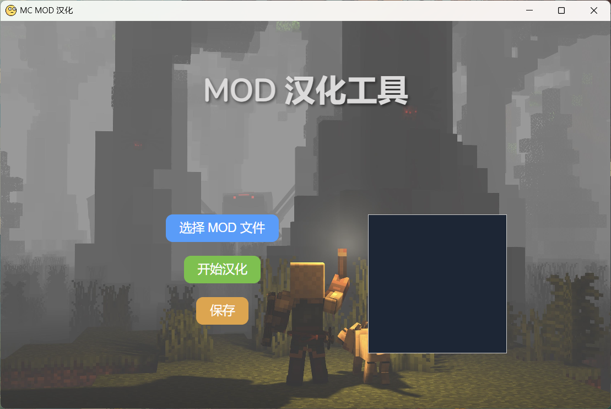
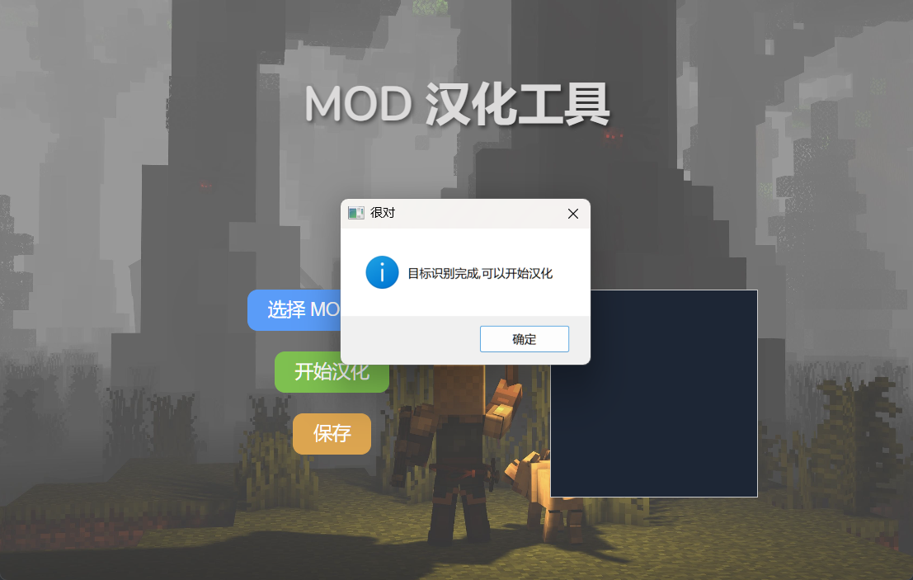
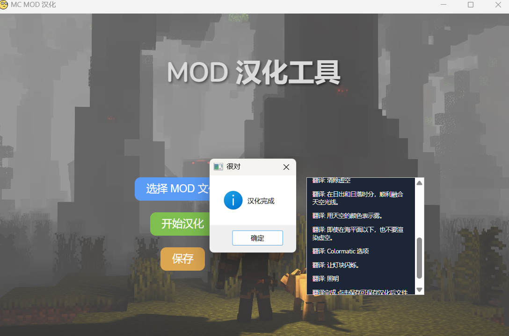
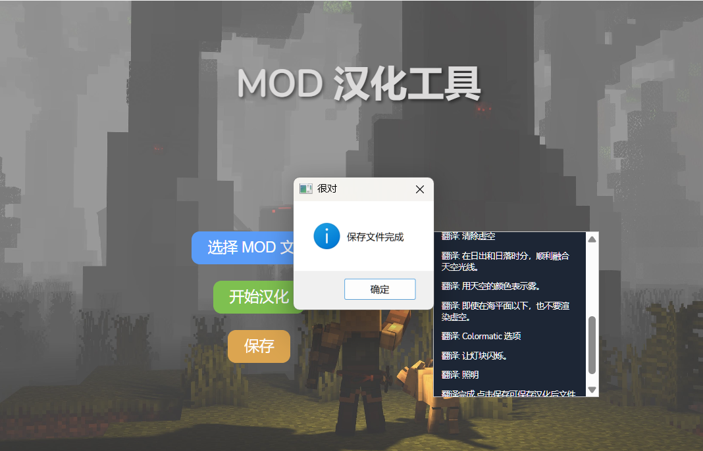

# MCMODHanHua

**MCMODHanHua** 是一个用于自动汉化 Minecraft 模组（MOD）的 Windows 桌面应用程序。它使用 Go 语言和 Wails 框架开发，并采用 MIT 许可证授权。

## 首页截图

## 功能介绍

- **实时翻译**：选择 MOD 文件后会进行实时翻译
- **用户友好的界面**：通过简单的图形界面，用户可以轻松地进行汉化操作，无需复杂的配置。
- **支持多种 MOD 格式**：支持的 MOD 文件格式为 `.jar` 

## 安装指南

### 下载安装包

你可以从 [Release 页面](https://github.com/QJKuan/MCMODHanHua/releases/) 的 `Assets` 内下载最新版本的安装包。

### 使用步骤

**需要有 Google Chrome 浏览器才能使用**

1. 下载安装包后，解压到一个空文件夹内
2. 双击 `MCModHanHua.exe` 即可启动
3. 按照步骤使用即可 ： 选择文件 ==》开始汉化 ==》 保存 
4. 使用过程截图

## 支持的 MOD 格式

- `.jar`

## 开发和贡献

如果你对这个项目感兴趣并希望贡献代码，欢迎 fork 本仓库并提交 Pull Request。我非常乐意接受帮助！

### 开发环境

- Go 语言环境
- Wails 框架

### 贡献指南

1. Fork 本仓库。
2. 创建新的分支进行开发。
3. 提交你的更改。
4. 创建 Pull Request。

## 许可证

本项目采用 MIT 许可证，详细内容见 [LICENSE](LICENSE) 文件。

## 联系方式

如果你有任何问题或建议，欢迎通过以下方式联系我：

- 邮箱：qj.kuan@outlook.com
- GitHub：[QJKuan](https://github.com/QJKuan/)

---

MC汉化不求人！！！
